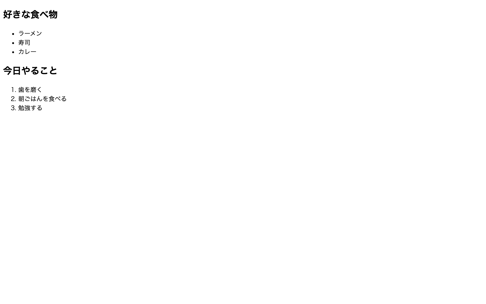

# 初級 問題03: リスト（ul / ol）

**難易度: ★☆☆☆☆☆☆☆☆☆**

## 🎯 やること

**番号なしリスト**（`<ul>`）と**番号付きリスト**（`<ol>`）を使い分けてみましょう。

## ✅ 要件

1. `<h2>好きな食べ物</h2>` の下に、`<ul>` を使って**番号なしリスト**を作る
   - ラーメン / 寿司 / カレー の3つ
2. `<h2>今日やること</h2>` の下に、`<ol>` を使って**番号付きリスト**を作る
   - 歯を磨く / 朝ごはんを食べる / 勉強する の3つ

## 👀 確認方法

- 好きな食べ物の前には「・」（黒丸）が付く
- 今日やることの前には「1. 2. 3.」と番号が付く

## 💡 ヒント

- `<ul>` … **u**nordered **l**ist（順序のないリスト）
- `<ol>` … **o**rdered **l**ist（順序のあるリスト）
- 中身は両方とも `<li>` … **l**ist **i**tem

---

🖼 期待される見た目（クリックで展開）

