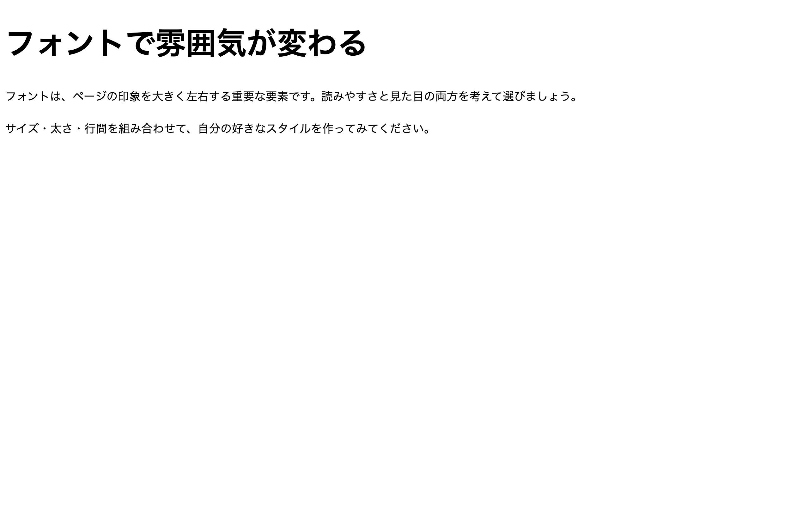

# 初級 問題06: フォントの指定

**難易度: ★★☆☆☆☆☆☆☆☆**

## 🎯 やること

CSS でフォントの**種類・大きさ・太さ**を変えてみましょう。

## ✅ 要件

`style.css` を編集して、次の通りに設定してください。

1. `<body>` のフォント種類を `sans-serif`（ゴシック体）にする
2. `<h1>` の**文字サイズ**を `48px` にする
3. `<h1>` の**太さ**を `bold` にする
4. `
` の**文字サイズ**を `18px` にする
5. `
` の**行間**を `1.8` にする

## 👀 確認方法

見出しが大きく太く、段落の文字が読みやすくゆったり表示されればOK。

## 💡 ヒント

- フォント種類 → `font-family`
- サイズ → `font-size`
- 太さ → `font-weight`
- 行間 → `line-height`（数値だけで OK、単位不要）

---

🖼 期待される見た目（クリックで展開）

<!-- 画像を追加するとき: このフォルダに preview.png を保存し、次の行のコメントを外す -->
<!--  -->

> 💡 模範解答をブラウザで開いてスクリーンショットを撮り、`preview.png` としてこのフォルダに保存すると、上の行のコメントを外すだけでプレビュー画像が表示されます。

