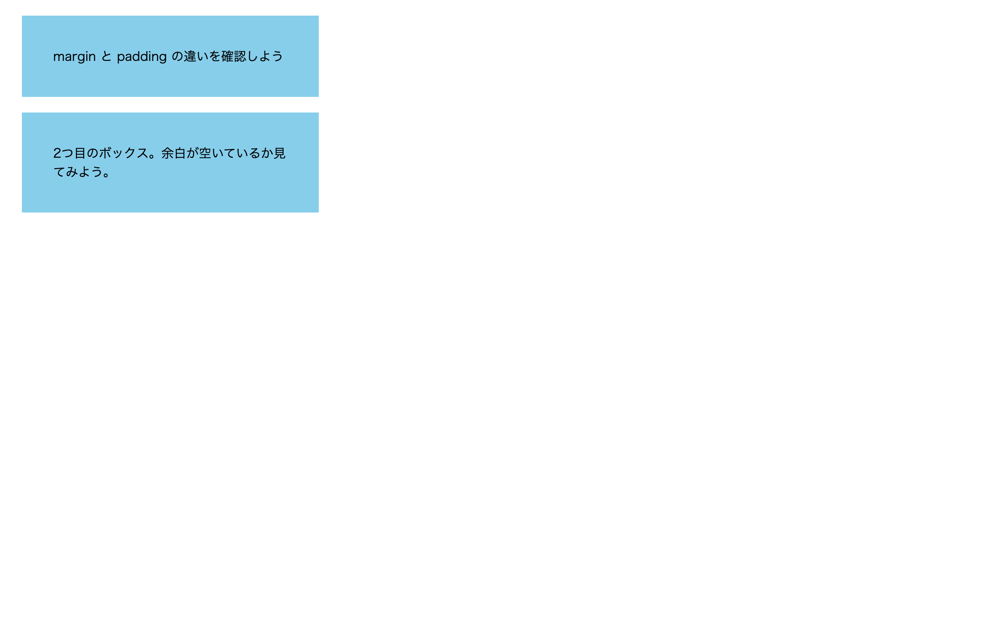

# 初級 問題07: margin と padding

**難易度: ★★☆☆☆☆☆☆☆☆**

## 🎯 やること

要素の**外側の余白**（margin）と**内側の余白**（padding）の違いを体感しましょう。

## ✅ 要件

`style.css` を編集して、次の通りに設定してください。

1. `.box` の**背景色**を `skyblue` にする
2. `.box` の**外側の余白**（上下左右）を `20px` にする
3. `.box` の**内側の余白**（上下左右）を `40px` にする
4. `.box` の**幅**を `300px` にする

## 👀 確認方法

- ボックスの周りに余白（margin）ができる
- ボックスの文字の周りにも余白（padding）ができ、文字が中央寄りに見える

## 💡 ヒント

- 外側余白 → `margin`
- 内側余白 → `padding`
- 「4辺まとめて」指定: `margin: 20px;`
- 「上下 / 左右」指定: `margin: 10px 20px;`

---

🖼 期待される見た目（クリックで展開）

<!-- 画像を追加するとき: このフォルダに preview.png を保存し、次の行のコメントを外す -->
<!--  -->

> 💡 模範解答をブラウザで開いてスクリーンショットを撮り、`preview.png` としてこのフォルダに保存すると、上の行のコメントを外すだけでプレビュー画像が表示されます。

