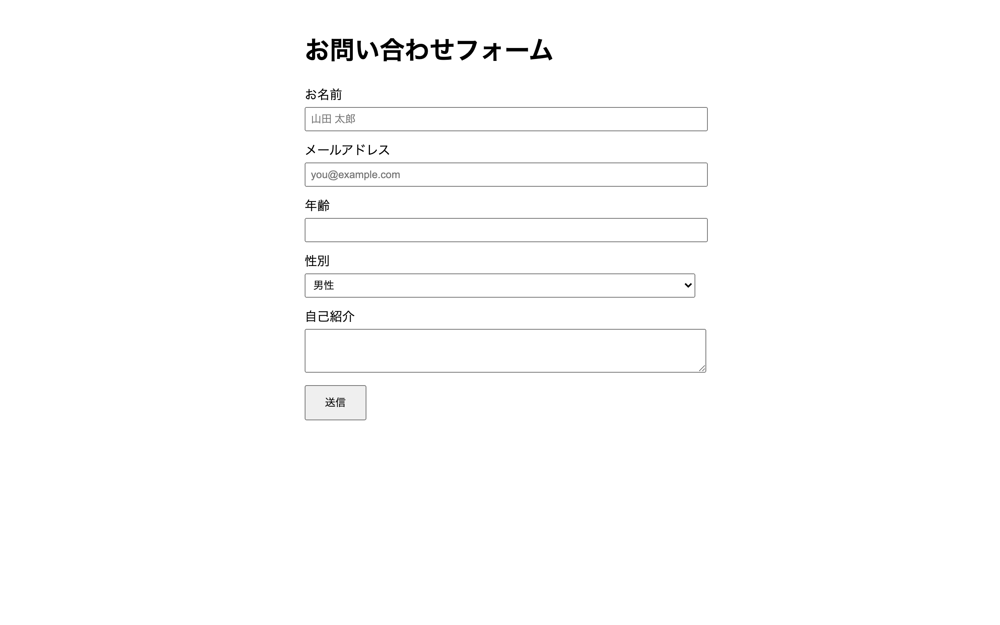

# 初級 問題10: フォームの基礎

**難易度: ★★★☆☆☆☆☆☆☆**

## 🎯 やること

ユーザーに情報を入力してもらう**フォーム**を作ってみましょう。

## ✅ 要件

`<form>` タグの中に以下を入れてください。

1. 「お名前」 → `<input type="text">`（`placeholder="山田 太郎"`）
2. 「メールアドレス」 → `<input type="email">`（`placeholder="you@example.com"`）
3. 「年齢」 → `<input type="number">`
4. 「性別」 → `<select>` で「男性 / 女性 / その他」から選べる
5. 「自己紹介」 → `<textarea>`（3行くらい書ける）
6. 「送信」と書かれた `<button type="submit">`

各入力欄の前には `<label>` を付けて、クリックでフォーカスできるようにしてください。
（`label` の `for` と `input` の `id` を対応させる）

## 👀 確認方法

- 入力欄に打ち込める
- ラベル部分をクリックすると、対応する入力欄にフォーカスが移る
- 送信ボタンを押すと、何も起きない（ページが再読み込みされる）

## 💡 ヒント

```html
<label for="name">お名前</label>
<input type="text" id="name">
```

---

<details>
<summary>🖼 期待される見た目（クリックで展開）</summary>



</details>
