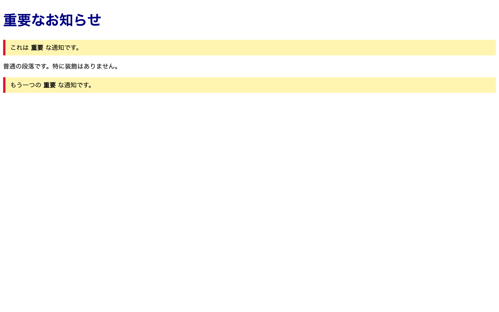

# 初級 問題11: class と id の使い分け

**難易度: ★★★☆☆☆☆☆☆☆**

## 🎯 やること

`class` と `id` を使い分けて、CSS のセレクタで狙い撃ちしてみましょう。

## ✅ 要件

HTML は用意されています。`style.css` を編集して、次を実現してください。

1. `.notice`（class）を持つ要素すべて に、**黄色背景 + 左側に赤い太い縦線（border-left）**を付ける
2. `#main-title`（id）の要素 に、**文字色を `navy`・文字サイズ `36px`** を適用する
3. クラス `.important` の要素の**文字を太字（bold）**にする

## 👀 確認方法

- 注意文（notice）が黄色背景になる
- メインタイトルだけ特別に濃い青色で大きくなる
- important のついた文字だけ太字

## 💡 ヒント

- クラスセレクタ: `.クラス名 { ... }`
- id セレクタ: `#id名 { ... }`
- `class` は同じページに**複数使える**、`id` は**1ページに1つだけ**が原則

---

🖼 期待される見た目（クリックで展開）

<!-- 画像を追加するとき: このフォルダに preview.png を保存し、次の行のコメントを外す -->
<!--  -->

> 💡 模範解答をブラウザで開いてスクリーンショットを撮り、`preview.png` としてこのフォルダに保存すると、上の行のコメントを外すだけでプレビュー画像が表示されます。

