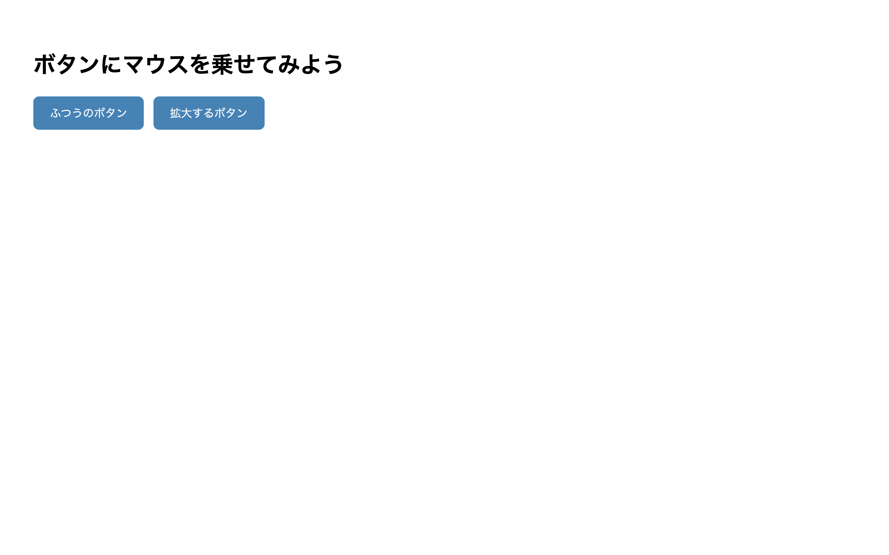

# 初級 問題12: :hover で見た目を変える

**難易度: ★★★☆☆☆☆☆☆☆**

## 🎯 やること

マウスを乗せたときにボタンの色や大きさが変わる **:hover** を使ってみましょう。

## ✅ 要件

用意された 3 つのボタンに次の効果を付けてください。

1. `.btn` 共通スタイル
   - 背景色: `steelblue`
   - 文字色: `white`
   - 枠線なし（`border: none`）
   - `padding: 12px 24px`
   - 角丸: `8px`
   - 文字サイズ: `16px`
   - カーソル: `pointer`
2. `.btn:hover` で**背景色を `tomato`** に変える
3. `.btn-grow:hover` で**1.1倍に拡大**（`transform: scale(1.1)`）する
4. すべての `.btn` に `transition: 0.2s` を付けて滑らかに変化させる

## 👀 確認方法

- マウスを乗せると背景色が変わる
- `.btn-grow` のボタンは拡大もする
- 変化が一瞬ではなく滑らか（0.2秒）

## 💡 ヒント

- `:hover` は**疑似クラス**。セレクタにくっつけて書く
- `.btn:hover { ... }` … `.btn` にマウスが乗ったとき

---

🖼 期待される見た目（クリックで展開）

<!-- 画像を追加するとき: このフォルダに preview.png を保存し、次の行のコメントを外す -->
<!--  -->

> 💡 模範解答をブラウザで開いてスクリーンショットを撮り、`preview.png` としてこのフォルダに保存すると、上の行のコメントを外すだけでプレビュー画像が表示されます。

