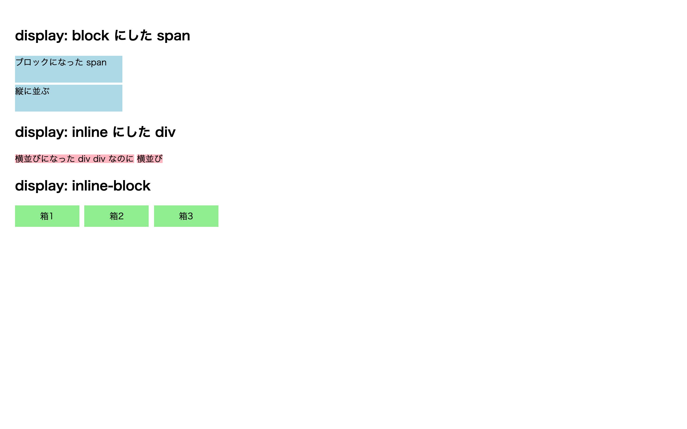

# 初級 問題13: display（block / inline）

**難易度: ★★★★☆☆☆☆☆☆**

## 🎯 やること

CSS の `display` プロパティで、要素の「**並び方**」を変えてみましょう。

## ✅ 要件

1. `.block-span` は `display: block;` にして、**幅 200px、高さ 50px、背景色 lightblue** にする
2. `.inline-div` は `display: inline;` にして、**背景色 lightpink** にする
3. `.ib` は `display: inline-block;` にして、**幅 120px、高さ 40px、背景色 lightgreen** にする
4. `.ib` を複数並べて、**横並び**になることを確認する

## 👀 確認方法

- `.block-span`：span なのに縦に並ぶ（幅・高さも効く）
- `.inline-div`：div なのに横に並ぶ（幅・高さは効かない）
- `.ib`：**横並びかつ幅・高さが効く**

## 💡 ヒント

| display | 改行 | 幅・高さ |
| --- | --- | --- |
| block | する（縦並び） | 効く |
| inline | しない（横並び） | 効かない |
| inline-block | しない | 効く ← 便利 |

---

🖼 期待される見た目（クリックで展開）

