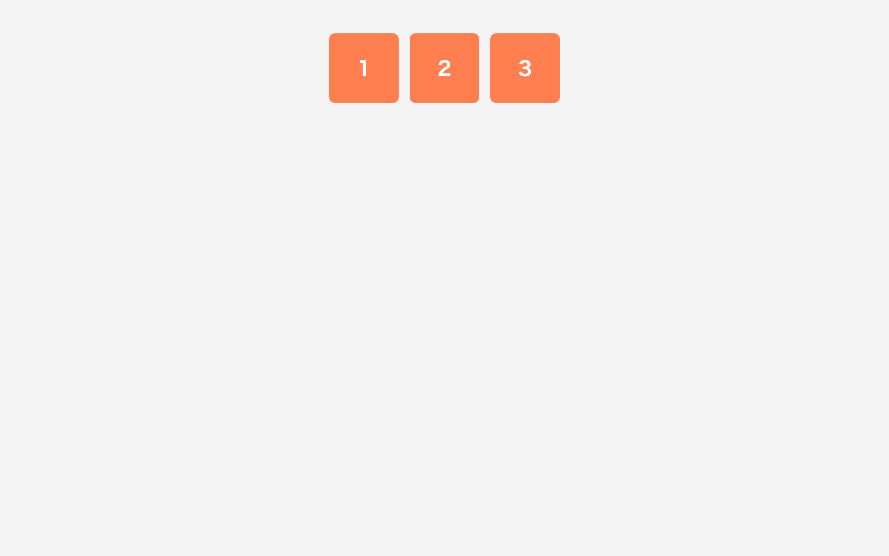

# 初級 問題14: Flexbox で横並び

**難易度: ★★★★☆☆☆☆☆☆**

## 🎯 やること

`display: flex;` で子要素を**横並び**にしてみましょう。現代のレイアウトの基本です。

## ✅ 要件

1. `.container` に次を指定
   - `display: flex;`
   - 子要素の間隔: `gap: 16px;`
   - 子要素を**中央寄せ**する（`justify-content: center`）
2. `.item`（子要素）に共通のスタイル
   - 背景色: `coral`
   - 文字色: 白
   - 幅: 100px、高さ: 100px
   - 中の文字を**縦横中央**に置く（flex で中央寄せ or line-height）
   - 角丸: 8px

## 👀 確認方法

3つの正方形が水平方向に中央揃えで横並びになり、各ボックスの中の数字も中央揃え。

## 💡 ヒント

- **親に** `display: flex;`（子ではなく親に付ける）
- `justify-content` … 主軸（横）の揃え
- `align-items` … 交差軸（縦）の揃え

---

🖼 期待される見た目（クリックで展開）

