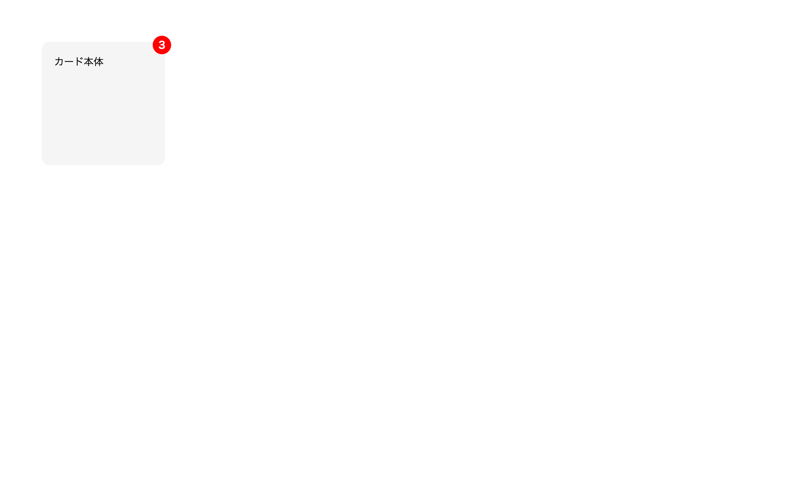

# 初級 問題16: position で要素を配置

**難易度: ★★★★☆☆☆☆☆☆**

## 🎯 やること

`position` を使って、**親要素の右上にバッジを重ねる**レイアウトを作ります。

## ✅ 要件

1. `.card` に次を設定
   - 背景色: `#f5f5f5`
   - 幅: 200px、高さ: 200px
   - 角丸: 12px
   - **position: relative**（← これ重要）
   - `margin: 40px`
2. `.badge` に次を設定
   - **position: absolute**
   - `top: -10px; right: -10px;`（右上に少し飛び出す）
   - 背景色: `red`、文字色: `white`
   - 幅: 30px、高さ: 30px
   - 丸型（border-radius: 50%）
   - 文字を中央に

## 👀 確認方法

- カードの右上角に赤い丸いバッジが少し飛び出して配置される

## 💡 ヒント

- `position: absolute` は「**最も近い `position` 指定のある祖先**」を基準に配置される
- なので **親 `.card` に `position: relative`** が必要

---

🖼 期待される見た目（クリックで展開）

<!-- 画像を追加するとき: このフォルダに preview.png を保存し、次の行のコメントを外す -->
<!--  -->

> 💡 模範解答をブラウザで開いてスクリーンショットを撮り、`preview.png` としてこのフォルダに保存すると、上の行のコメントを外すだけでプレビュー画像が表示されます。

