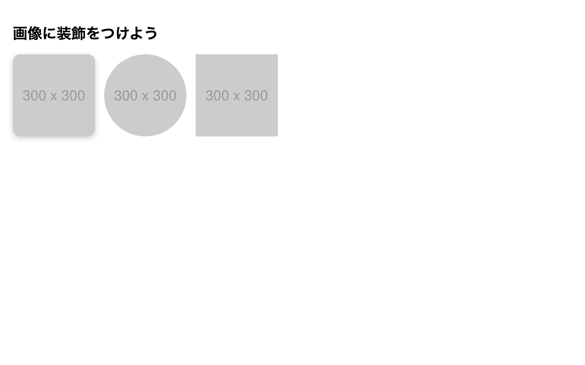

# 初級 問題17: 画像の装飾（角丸・影）

**難易度: ★★★★☆☆☆☆☆☆**

## 🎯 やること

画像を**丸く切り抜く**、**影を付ける**などの装飾を試しましょう。

## ✅ 要件

3枚の画像にそれぞれ別のスタイルを適用します。

1. `.img-round` … **角を少し丸くする**（`border-radius: 16px`）+ 影を付ける（`box-shadow: 0 4px 12px rgba(0,0,0,0.2)`）
2. `.img-circle` … **完全に円形**にする（`border-radius: 50%`）
3. `.img-filter` … グレースケール（`filter: grayscale(100%)`）+ **hover で元の色に戻す**

共通：
- 全ての画像の幅と高さを `180px`
- `object-fit: cover;` で切れないようにする
- `.img-filter` の hover に `transition: 0.3s` を付ける

---

🖼 期待される見た目（クリックで展開）

<!-- 画像を追加するとき: このフォルダに preview.png を保存し、次の行のコメントを外す -->
<!--  -->

> 💡 模範解答をブラウザで開いてスクリーンショットを撮り、`preview.png` としてこのフォルダに保存すると、上の行のコメントを外すだけでプレビュー画像が表示されます。

