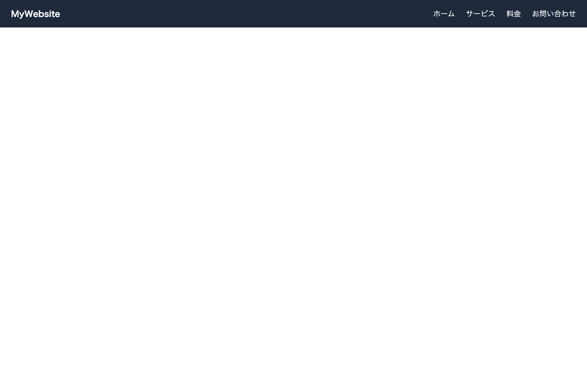

# 初級 問題19: ナビゲーションバー

**難易度: ★★★★★☆☆☆☆☆**

## 🎯 やること

ヘッダーによくある**ナビゲーションバー**を作ります。

## ✅ 要件

1. `<nav>` の中に**左側にロゴ**、**右側にメニューリンク**を配置
2. メニューは `<ul>` と `<li>` で作る（`<a>` 要素で各リンク）
3. レイアウトは **Flexbox** で
4. ホバーでリンクの色が変わる
5. CSS の詳細：
   - 背景色: `#1e293b`、文字色: 白、高さ 60px
   - ロゴは太字、18px
   - リストの `list-style: none`、`padding: 0`、`margin: 0`
   - リンクの下線を消す（`text-decoration: none`）
   - リンクホバー時に文字色が `#f97316` になる

## 👀 確認方法

- ロゴが左、メニューが右に配置される
- メニュー項目にマウスを乗せると色が変わる
- 下線なし

---

🖼 期待される見た目（クリックで展開）

