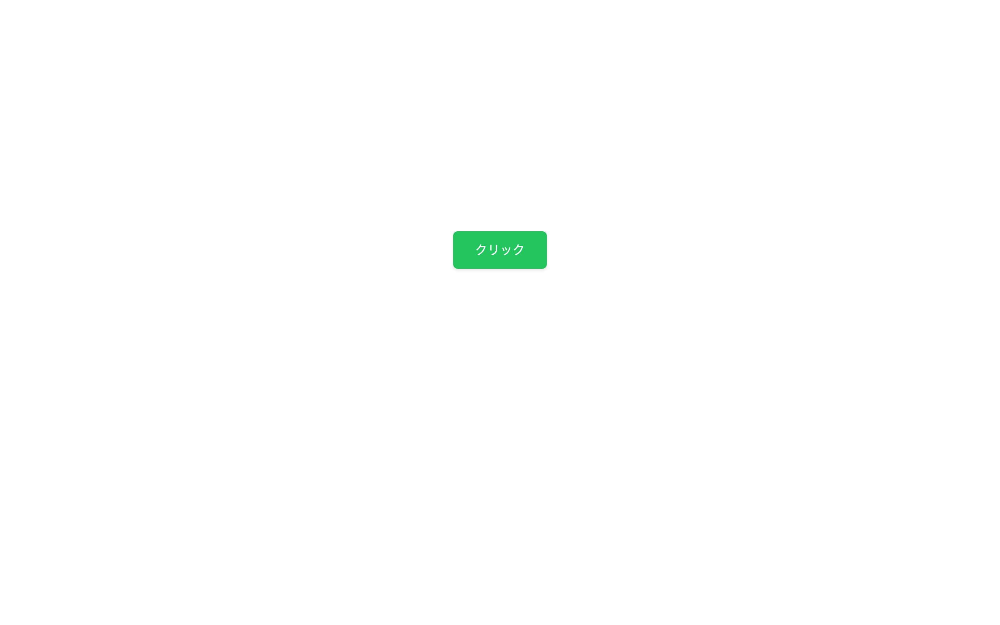

# 中級 問題02: transition で滑らかな変化

**難易度: ★★★☆☆☆☆☆☆☆**

## 🎯 やること

`transition` を使って、**値の変化を滑らかに**する練習です。

## ✅ 要件

用意された `.btn` ボタンに次の挙動を加えてください。

1. 基本スタイル: 緑（`#22c55e`）の背景、白文字、padding 12px 28px、角丸 6px、border なし、cursor pointer
2. hover 時
   - 背景色が`#15803d`になる
   - 文字色は白のまま
   - `transform: translateY(-3px)` で少し浮く
   - `box-shadow: 0 6px 16px rgba(0,0,0,0.2)` で影が濃くなる
3. **変化は 0.25 秒** で滑らかに（`transition` で指定）
4. active（押された瞬間）では `translateY(1px)` で少し押し込む

## 👀 確認方法

- ホバーで浮く・色変化・影 が同時に滑らかに起こる
- クリックすると一瞬沈む

---

🖼 期待される見た目（クリックで展開）

<!-- 画像を追加するとき: このフォルダに preview.png を保存し、次の行のコメントを外す -->
<!--  -->

> 💡 模範解答をブラウザで開いてスクリーンショットを撮り、`preview.png` としてこのフォルダに保存すると、上の行のコメントを外すだけでプレビュー画像が表示されます。

