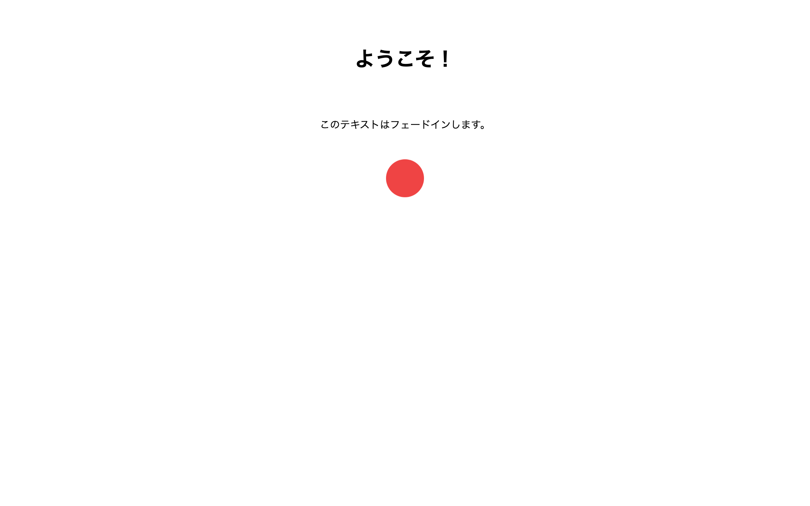

# 中級 問題03: @keyframes アニメーション

**難易度: ★★★★☆☆☆☆☆☆**

## 🎯 やること

`@keyframes` を使って**フェードイン**と**バウンス**のアニメーションを作ります。

## ✅ 要件

1. `.fade-in` のアニメーション
   - `opacity: 0` から `opacity: 1` へ
   - `transform: translateY(20px)` → `translateY(0)`
   - 所要時間 0.8 秒、`ease-out`

2. `.bounce` のアニメーション
   - 上下に弾むように動く（`translateY(0) → -20px → 0 → -10px → 0` のような動き）
   - 所要時間 1.5 秒
   - **無限ループ**（`infinite`）

## 👀 確認方法

- ページを開くと、`.fade-in` がふわっと下から浮かび上がる
- `.bounce` の円が上下にずっと弾む

## 💡 ヒント

```css
@keyframes 名前 {
  from { ... }
  to   { ... }
}

.target {
  animation: 名前 1s ease-out;
}
```

`from`/`to` のほか、`0% { } 50% { } 100% { }` のように細かく書ける。

---

<details>
<summary>🖼 期待される見た目（クリックで展開）</summary>

<!-- 画像を追加するとき: このフォルダに preview.png を保存し、次の行のコメントを外す -->
<!--  -->

> 💡 模範解答をブラウザで開いてスクリーンショットを撮り、`preview.png` としてこのフォルダに保存すると、上の行のコメントを外すだけでプレビュー画像が表示されます。

</details>
