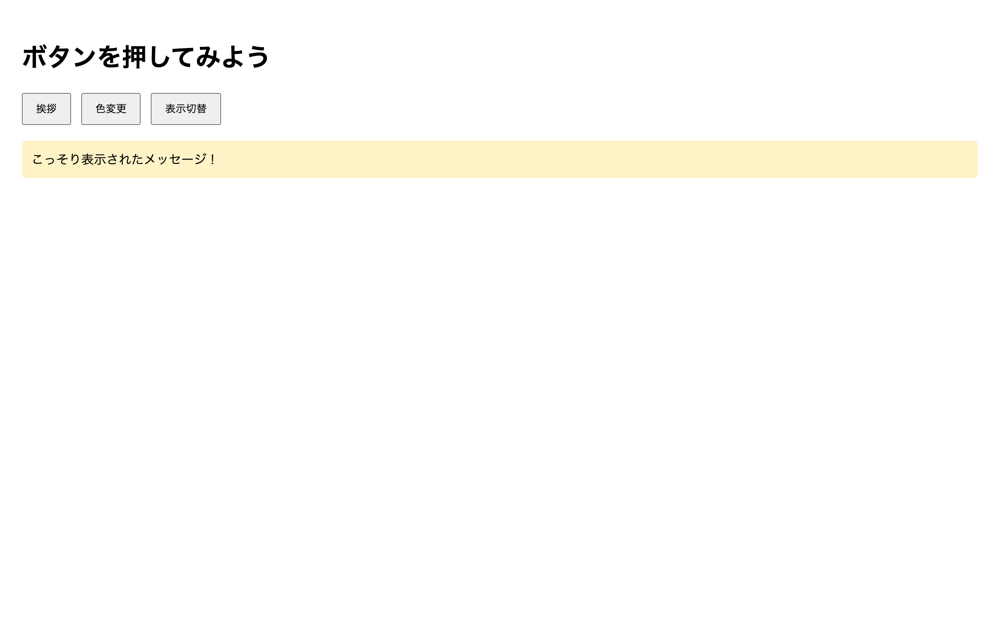

# 中級 問題06: click イベントリスナー

**難易度: ★★★★☆☆☆☆☆☆**

## 🎯 やること

ボタンをクリックしたときに JavaScript で何かをする**イベントリスナー**を学びます。

## ✅ 要件

`script.js` に次の動作を実装してください。

1. 「挨拶」ボタン（`#greet`）をクリックすると、alert で `"こんにちは！"` と表示
2. 「色変更」ボタン（`#color`）をクリックするごとに、ページの背景色が**ランダムな色**に変わる
3. 「表示切替」ボタン（`#toggle`）をクリックするごとに、`.secret` の表示／非表示が切り替わる（`hidden` 属性の付け外し）

## 👀 確認方法

- 各ボタンの挙動が要件通りに動く
- 特に「表示切替」はクリックごとに切り替わる

## 💡 ヒント

```js
document.querySelector('#greet').addEventListener('click', () => {
  alert('こんにちは！');
});
```

### ランダムな色の作り方（例）
```js
const color = `#${Math.floor(Math.random()*0xffffff).toString(16).padStart(6, '0')}`;
```

---

<details>
<summary>🖼 期待される見た目（クリックで展開）</summary>



</details>
