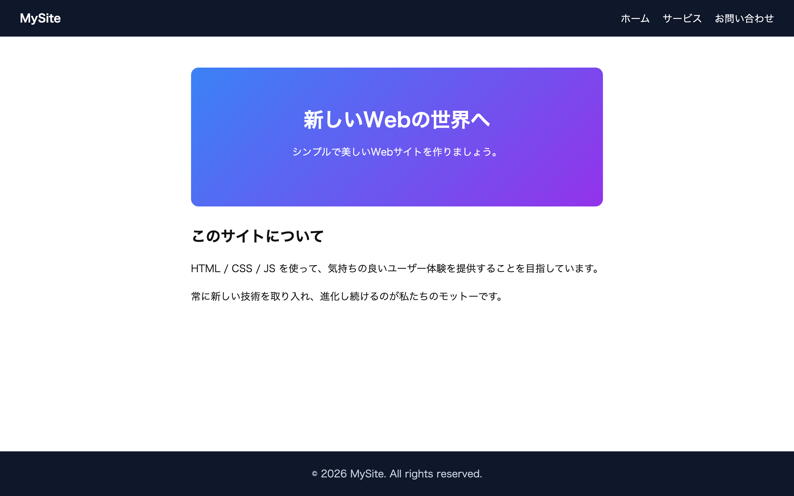

# 中級 問題11: ヘッダーとフッターのあるページ

**難易度: ★★★★★☆☆☆☆☆**

## 🎯 やること

**ヘッダー / メイン / フッター**の 3 つの領域を持つ、一般的な Web ページの構造を作ります。

## ✅ 要件

1. `<header>` 要素
   - 左にサイトタイトル、右にナビメニュー（ホーム / サービス / お問い合わせ）
   - 画面上部に固定しない普通のヘッダーで OK
   - 背景色 `#0f172a`、文字色白、padding `16px 32px`

2. `<main>` 要素
   - ヒーローセクション（背景画像風の大きい見出しエリア）＋ 本文 2〜3 段落
   - `max-width: 800px; margin: 0 auto;` で中央寄せ

3. `<footer>` 要素
   - コピーライトを中央揃えで
   - 背景色 `#0f172a`、文字色 `#cbd5e1`、padding `24px`

4. `<html>` と `<body>` に `height: 100%;` を適用し、本文が少なくても**フッターが下に貼り付く**ようにする（Flex で `min-height: 100vh` の body を縦 Flex にして main に `flex: 1` 指定）

## 💡 ヒント

```css
body {
  display: flex;
  flex-direction: column;
  min-height: 100vh;
}
main { flex: 1; }
```

---

<details>
<summary>🖼 期待される見た目（クリックで展開）</summary>



</details>
