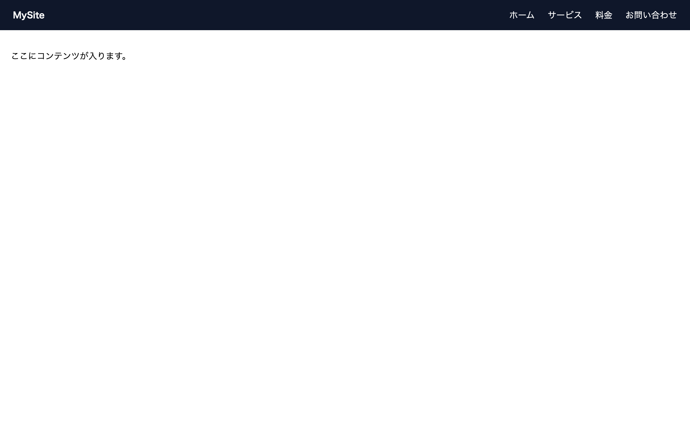

# 中級 問題12: ハンバーガーメニュー

**難易度: ★★★★★★☆☆☆☆**

## 🎯 やること

スマホでよく見る**ハンバーガーメニュー**を作ります。

## ✅ 要件

1. **画面幅 768px 以下**ではナビが隠れていて、**ハンバーガーアイコン**だけ見える
2. アイコンをクリックすると、メニューがスライドで出現／非表示が切り替わる
3. 画面幅 769px 以上ではハンバーガーは消え、ナビは横並びで表示される
4. 実装は `classList.toggle('open')` を使い、**見た目は CSS で制御**

## 💡 ヒント

- モバイル: `.menu` を `transform: translateX(-100%)` で画面外に出しておく
- `.menu.open` で `translateX(0)` にする
- `transition` で滑らかに

---

🖼 期待される見た目（クリックで展開）

