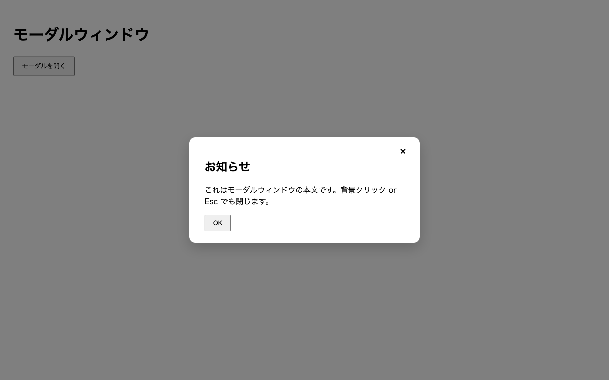

# 中級 問題13: モーダルウィンドウ

**難易度: ★★★★★★☆☆☆☆**

## 🎯 やること

画面中央にポップアップする**モーダルウィンドウ**を作ります。

## ✅ 要件

1. ページに「モーダルを開く」ボタン（`#openBtn`）
2. クリックすると **半透明のオーバーレイ + 中央の白いパネル** が出現
3. パネル内に閉じるボタン（`#closeBtn`）と「× 」ボタン（`#closeX`）、タイトル、本文、OK ボタン
4. **オーバーレイのクリックで閉じる**（パネル自体のクリックでは閉じない）
5. **Esc キーで閉じる**
6. モーダルが開いている間、body のスクロールを無効にする（`body` に `no-scroll` クラスで `overflow: hidden`）

## 💡 ヒント

```js
// イベントの伝播を止める
panel.addEventListener('click', (e) => e.stopPropagation());
```

```js
document.addEventListener('keydown', (e) => {
  if (e.key === 'Escape') closeModal();
});
```

---

<details>
<summary>🖼 期待される見た目（クリックで展開）</summary>



</details>
