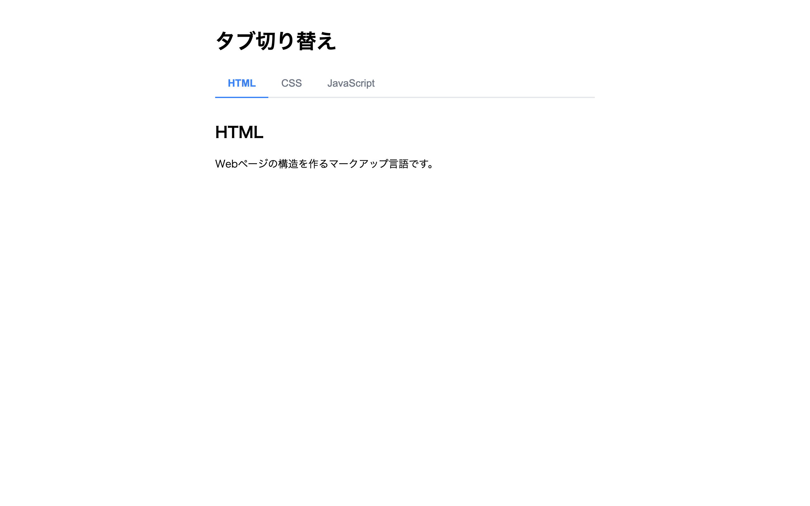

# 中級 問題14: タブ切り替え

**難易度: ★★★★★★☆☆☆☆**

## 🎯 やること

3 つのタブの切り替え UI を実装します。

## ✅ 要件

1. タブボタン 3 つ（`data-tab="1"`, `"2"`, `"3"`）とコンテンツ 3 つ（`data-content="1"`, `"2"`, `"3"`）が HTML に用意されている
2. 初期状態では **タブ 1** がアクティブで、コンテンツ 1 が表示される
3. 他のタブをクリックすると、**そのタブだけ `.active`** クラスが付き、**対応するコンテンツだけ表示**される
4. 非アクティブのコンテンツは `hidden` 属性で隠す

## 💡 ヒント

`data-*` 属性は `element.dataset.xxx` で取得できる。

```js
btn.dataset.tab  // "1" など
```

---

<details>
<summary>🖼 期待される見た目（クリックで展開）</summary>



</details>
