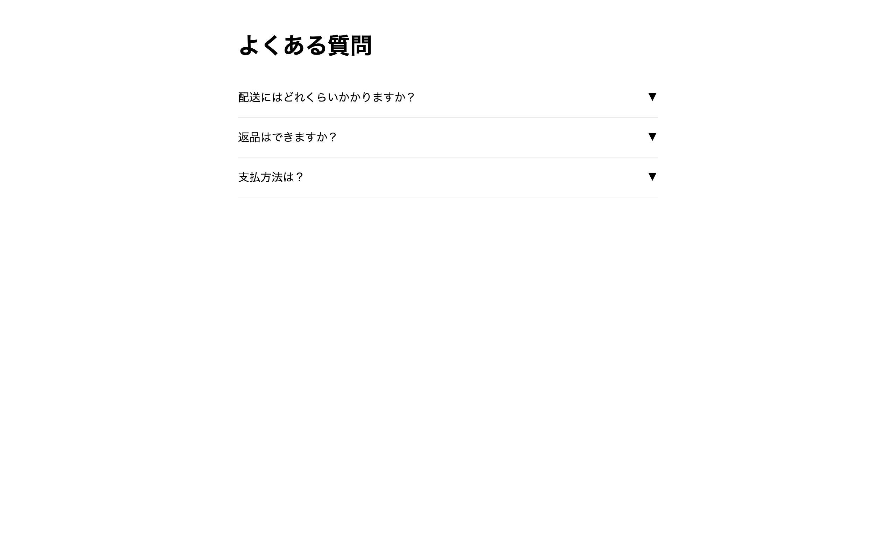

# 中級 問題15: アコーディオン

**難易度: ★★★★★★☆☆☆☆**

## 🎯 やること

FAQ などでよく見る、クリックすると**開閉**する**アコーディオン**を作ります。

## ✅ 要件

1. 用意された 3 つの `.accordion-item` で、それぞれの `.question` をクリックすると `.answer` が**スライドで開閉**する
2. 同時に**1つしか開かない**（他を開いたら前に開いていたものは閉じる）
3. 開いているアイテムには `.open` クラス、回答部分は `max-height` で高さを制御
4. 矢印アイコンは `.open` 時に 180 度回転させる

## 💡 ヒント

`height: auto` はアニメーションしないので、`max-height` を使う：
```css
.answer { max-height: 0; overflow: hidden; transition: max-height 0.3s; }
.open .answer { max-height: 500px; }
```

---

<details>
<summary>🖼 期待される見た目（クリックで展開）</summary>



</details>
