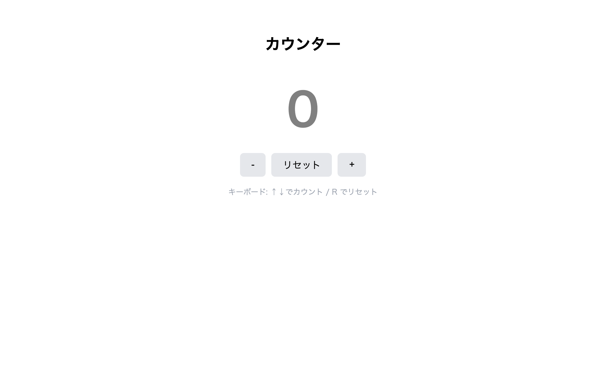

# 中級 問題18: カウンターアプリ

**難易度: ★★★★★★★☆☆☆**

## 🎯 やること

クリックで増減する**カウンター**を作ります。

## ✅ 要件

1. 「+」「-」ボタンと**リセット**ボタンがある
2. 画面中央に大きく現在の数値を表示
3. 数値の状態に応じて色が変わる：
   - **負数** → 赤
   - **0** → グレー
   - **正数** → 青
4. マイナスボタンで 0 未満にも行ける
5. リセットは 0 にする
6. キーボードの `↑` で +1、`↓` で -1、`R` でリセット も動作する

## 💡 ヒント

```js
let count = 0;
function update() {
  display.textContent = count;
  display.style.color = count < 0 ? 'red' : count === 0 ? 'gray' : 'blue';
}
```

---

<details>
<summary>🖼 期待される見た目（クリックで展開）</summary>



</details>
