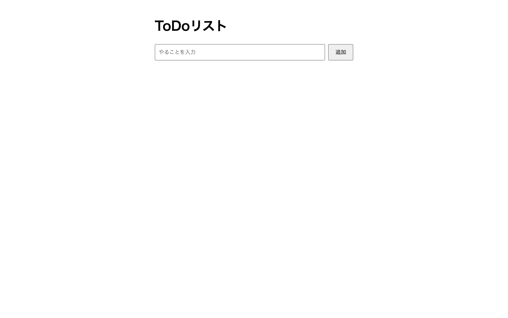

# 中級 問題19: ToDoリスト（基本）

**難易度: ★★★★★★★☆☆☆**

## 🎯 やること

シンプルな**ToDo リスト**を作ります（保存機能なし）。

## ✅ 要件

1. 入力欄（`#input`）と「追加」ボタン（`#addBtn`）
2. 追加ボタンで入力内容を `<li>` として `<ul>` に追加
3. 空欄のまま追加しようとしたら何もしない
4. 追加された項目にはチェックボックスと「削除」ボタンが付く
5. チェックボックスで完了状態 → 取り消し線（クラス `.done`）
6. 「削除」で項目が消える
7. Enter キーでも追加できる

## 💡 ヒント

```js
// li に様々な子要素を組み立てる
const li = document.createElement('li');
const checkbox = document.createElement('input');
checkbox.type = 'checkbox';
```

---

<details>
<summary>🖼 期待される見た目（クリックで展開）</summary>

<!-- 画像を追加するとき: このフォルダに preview.png を保存し、次の行のコメントを外す -->
<!--  -->

> 💡 模範解答をブラウザで開いてスクリーンショットを撮り、`preview.png` としてこのフォルダに保存すると、上の行のコメントを外すだけでプレビュー画像が表示されます。

</details>
