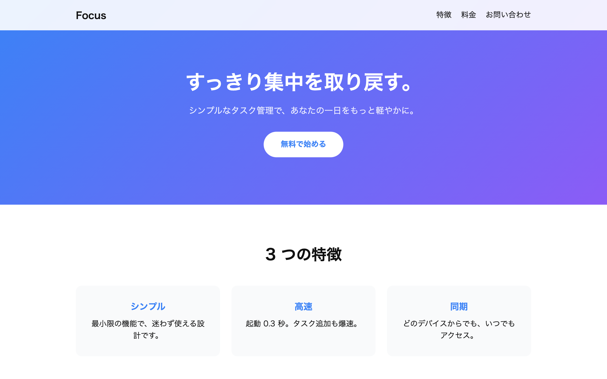

# 中級 問題20: ランディングページ

**難易度: ★★★★★★★☆☆☆**

## 🎯 やること

中級の集大成として、**1 枚のランディングページ**（LP）を作ります。

## ✅ 要件

以下のセクションを持つ縦長の LP を作ってください（中身・デザインは自由）。

1. **ヘッダー**（ロゴ + ナビ、レスポンシブ対応）
2. **ヒーロー**（大きな見出し + サブテキスト + CTA ボタン）
3. **特徴3つ**（3カラム、スマホで1カラムに）
4. **料金プラン**（3つのプラン、中央のプランが目立つ）
5. **お問い合わせフォーム**（名前、メール、メッセージ、送信ボタン）
6. **フッター**（コピーライト + SNS リンク）

CSS：
- レスポンシブ（スマホで1カラム）
- スクロールしたときに滑らかに移動（`scroll-behavior: smooth`）
- ナビの各リンクは `href="#section-id"` でページ内ジャンプ

JS：
- フォーム送信時にバリデーション（簡易でOK）
- スクロール位置に応じてヘッダーの色を変えてもOK

**この問題に満点はありません。** 自分なりの工夫を入れましょう。

---

🖼 期待される見た目（クリックで展開）

<!-- 画像を追加するとき: このフォルダに preview.png を保存し、次の行のコメントを外す -->
<!--  -->

> 💡 模範解答をブラウザで開いてスクリーンショットを撮り、`preview.png` としてこのフォルダに保存すると、上の行のコメントを外すだけでプレビュー画像が表示されます。

