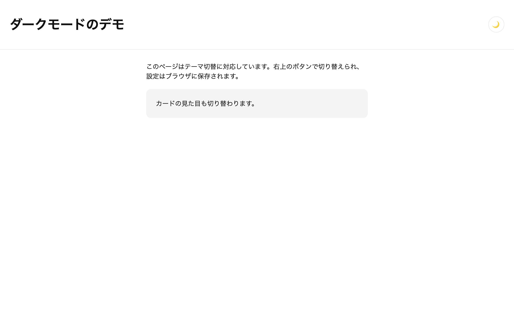

# 上級 問題01: ダークモード切替

**難易度: ★★★★★☆☆☆☆☆**

## 🎯 やること

ページのライトモード／ダークモードを**切り替え**、その選択を**LocalStorage に保存**してリロード後も保持します。

## ✅ 要件

1. 画面右上のトグルボタン（`#themeToggle`）でライト／ダークを切り替え
2. ダーク時は `<body>` に `.dark` クラスが付く
3. 切り替えたテーマを `localStorage` に保存（キー: `theme`、値: `light` or `dark`）
4. ページ読み込み時に、保存されたテーマを復元する
5. CSS は **CSS変数（カスタムプロパティ）** を使って定義し、`.dark` クラスで上書きする

## 💡 ヒント

```css
:root {
  --bg: white;
  --fg: #111;
}
body.dark {
  --bg: #111;
  --fg: #eee;
}
body {
  background: var(--bg);
  color: var(--fg);
}
```

```js
localStorage.setItem('theme', 'dark');
const saved = localStorage.getItem('theme');
```

---

<details>
<summary>🖼 期待される見た目（クリックで展開）</summary>

<!-- 画像を追加するとき: このフォルダに preview.png を保存し、次の行のコメントを外す -->
<!--  -->

> 💡 模範解答をブラウザで開いてスクリーンショットを撮り、`preview.png` としてこのフォルダに保存すると、上の行のコメントを外すだけでプレビュー画像が表示されます。

</details>
