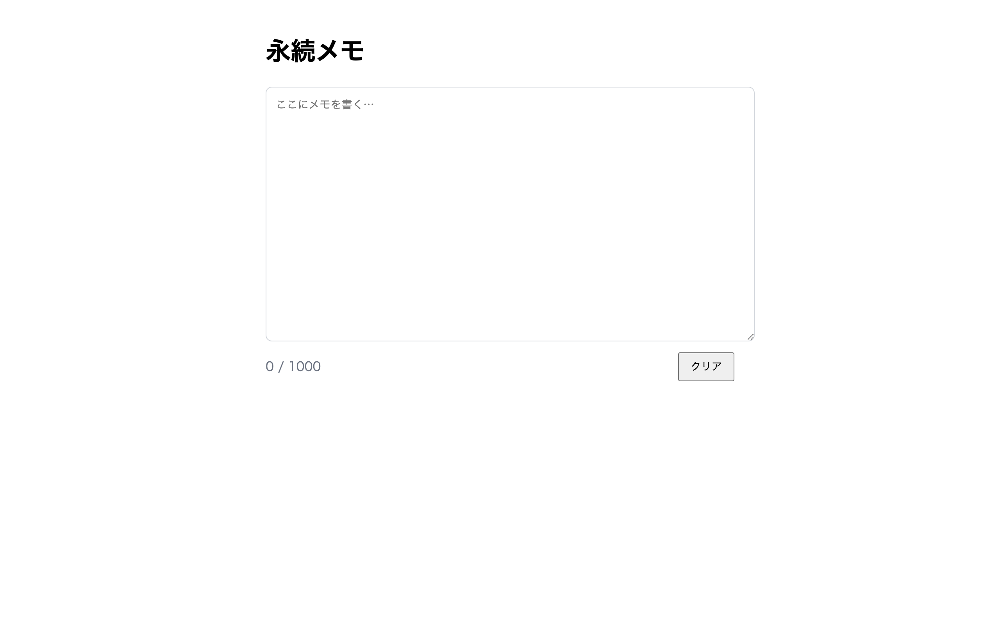

# 上級 問題02: LocalStorage でデータ保存

**難易度: ★★★★★★☆☆☆☆**

## 🎯 やること

ユーザーの入力値を `localStorage` に保存し、**リロードしても復元される**メモ帳を作ります。

## ✅ 要件

1. `<textarea id="memo">` にテキストを入力できる
2. 入力内容を**リアルタイム**（`input` イベント）で `localStorage` に保存
3. ページを再読み込みすると、**前回の内容**が復元される
4. 「クリア」ボタンで内容と保存を削除
5. 保存キーは `savedMemo`
6. 文字数カウンター（現在の文字数 / 最大 1000 文字）を表示、1000 超えると `.over` クラスで赤色に

## 💡 ヒント

```js
localStorage.setItem('savedMemo', textarea.value);
textarea.value = localStorage.getItem('savedMemo') || '';
```

---

<details>
<summary>🖼 期待される見た目（クリックで展開）</summary>



</details>
