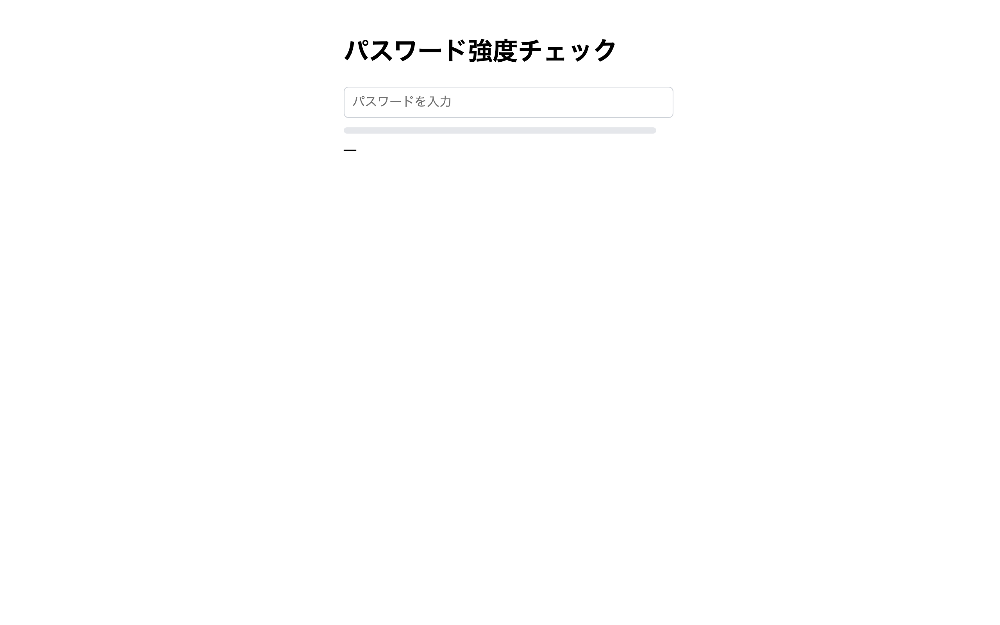

# 上級 問題04: パスワード強度チェッカー

**難易度: ★★★★★★☆☆☆☆**

## 🎯 やること

入力されたパスワードの**強度**を判定し、色付きのバーと文言で即時フィードバックします。

## ✅ 要件

パスワードの強度を次の基準で採点（満たすごとに +1、最大 5 点）：
1. 8 文字以上
2. 小文字を含む
3. 大文字を含む
4. 数字を含む
5. 記号を含む（`!@#$%^&*...`）

スコア別の表示：
| スコア | ラベル | バーの色 |
| --- | --- | --- |
| 0-1 | とても弱い | red |
| 2 | 弱い | orange |
| 3 | 普通 | gold |
| 4 | 強い | green |
| 5 | とても強い | darkgreen |

バーの幅はスコア × 20%（0 → 0%、5 → 100%）。

## 💡 ヒント

```js
const hasLower = /[a-z]/.test(pw);
const hasUpper = /[A-Z]/.test(pw);
const hasDigit = /\d/.test(pw);
const hasSymbol = /[!@#$%^&*(),.?":{}|<>]/.test(pw);
```

---

<details>
<summary>🖼 期待される見た目（クリックで展開）</summary>



</details>
