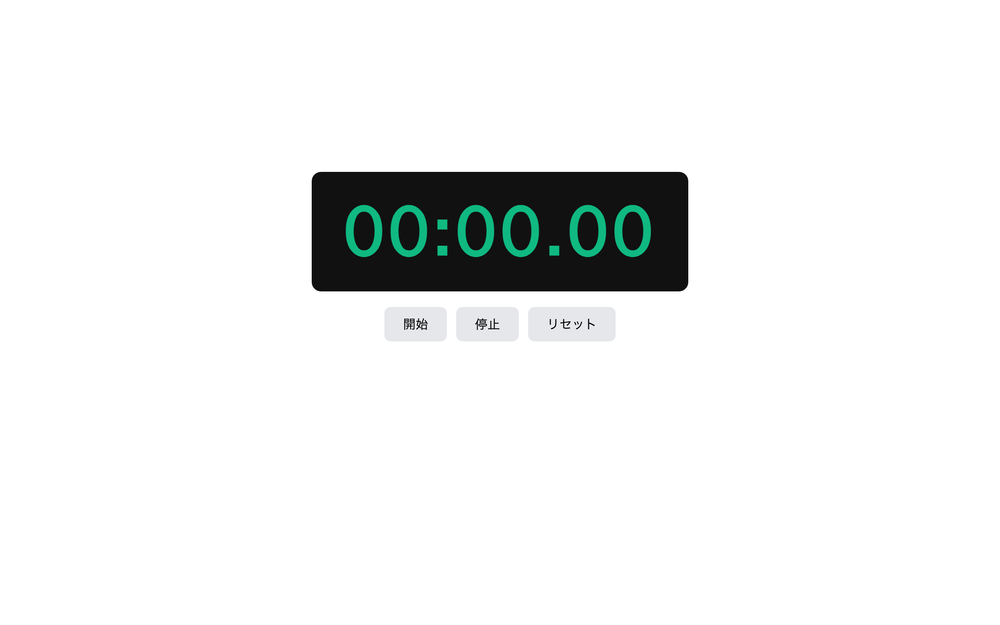

# 上級 問題06: ストップウォッチ

**難易度: ★★★★★★★☆☆☆**

## 🎯 やること

`setInterval` を使った**ストップウォッチ**を作ります。

## ✅ 要件

1. 時刻表示は `mm:ss.cc`（分:秒.10ミリ秒）
2. ボタン：開始・停止・リセット
3. 開始 → 10ms ごとに更新（`setInterval(fn, 10)`）
4. 停止 → `clearInterval` で止める（値は保持）
5. リセット → 0 に戻す（停止中のみ有効）
6. 開始中は「開始」ボタンが押せない（`disabled` 属性）

## 💡 ヒント

```js
let startTime;
let elapsed = 0;
let timerId = null;

function tick() {
  const now = Date.now();
  elapsed = now - startTime; // ミリ秒
  display.textContent = format(elapsed);
}
```

`Date.now()` の差分を取るのが**時刻ずれに強い**書き方。

---

<details>
<summary>🖼 期待される見た目（クリックで展開）</summary>



</details>
