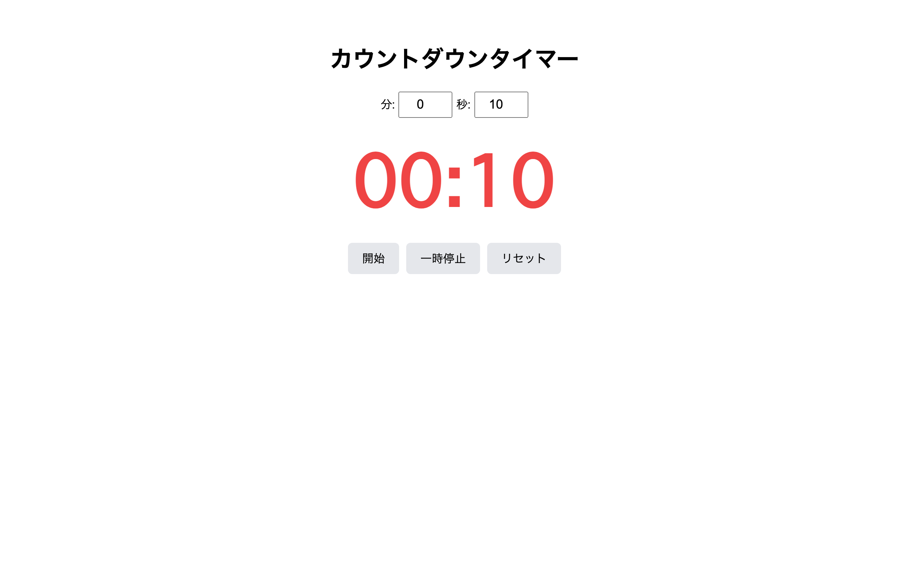

# 上級 問題07: カウントダウンタイマー

**難易度: ★★★★★★★☆☆☆**

## 🎯 やること

秒数を指定して 0 までカウントダウンする**キッチンタイマー**を作ります。

## ✅ 要件

1. 分と秒の入力欄、「開始」「一時停止」「リセット」ボタン
2. 残り時間を大きく表示 (`mm:ss`)
3. 1 秒ごとに減る
4. 0 に到達したら `alert("時間です！")` を出し、タイマーを止める
5. 一時停止中は再開できる
6. 残り 10 秒以下になったら表示を**赤色**に
7. 残り 5 秒以下になったら**点滅**アニメーション（`@keyframes`）を付ける

## 💡 ヒント

```js
let remaining = 60; // 秒
setInterval(() => {
  remaining--;
  if (remaining <= 0) { /* 終了処理 */ }
}, 1000);
```

---

<details>
<summary>🖼 期待される見た目（クリックで展開）</summary>

<!-- 画像を追加するとき: このフォルダに preview.png を保存し、次の行のコメントを外す -->
<!--  -->

> 💡 模範解答をブラウザで開いてスクリーンショットを撮り、`preview.png` としてこのフォルダに保存すると、上の行のコメントを外すだけでプレビュー画像が表示されます。

</details>
