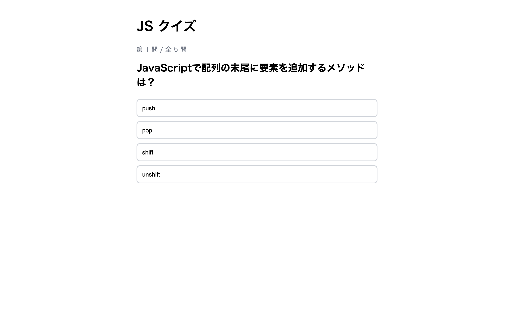

# 上級 問題08: クイズアプリ

**難易度: ★★★★★★★☆☆☆**

## 🎯 やること

4 択の**クイズ**を次々出題し、最後にスコアを表示するアプリを作ります。

## ✅ 要件

1. 問題データを配列で持つ（`{ question, options, answer }` × 5問）
2. 1問ずつ表示し、4つの選択肢ボタンを表示
3. 選択肢を押すと、正解なら緑、不正解なら赤になり、正解を強調表示
4. 正解なら score を +1、1.5 秒後に次の問題へ進む
5. 最後の問題が終わったら結果画面に切り替え、「N 問中 M 問正解！」「リトライ」ボタン
6. リトライで最初からやり直し

## 💡 ヒント

```js
const questions = [
  { question: "...", options: ["A", "B", "C", "D"], answer: "A" },
  ...
];
let index = 0, score = 0;
```

---

<details>
<summary>🖼 期待される見た目（クリックで展開）</summary>

<!-- 画像を追加するとき: このフォルダに preview.png を保存し、次の行のコメントを外す -->
<!--  -->

> 💡 模範解答をブラウザで開いてスクリーンショットを撮り、`preview.png` としてこのフォルダに保存すると、上の行のコメントを外すだけでプレビュー画像が表示されます。

</details>
