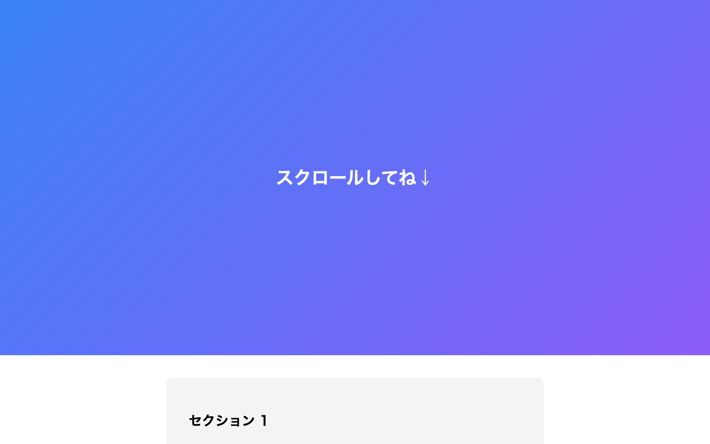

# 上級 問題09: スクロールアニメーション

**難易度: ★★★★★★★★☆☆**

## 🎯 やること

**画面に入った瞬間に要素がフェードイン**する、スクロール連動アニメーションを実装します。

## ✅ 要件

1. 複数の `.fade-target` 要素（見出し・画像・カードなど）を縦に並べる
2. 初期状態は `opacity: 0; transform: translateY(30px);`
3. 画面内にスクロールで入ったタイミングで `.visible` クラスが付き、`opacity: 1; translateY(0)` になる
4. 判定には **`IntersectionObserver`** を使う（`getBoundingClientRect` の代わりに）
5. 一度表示されたら戻っても再アニメーションしない（`observer.unobserve`）

## 💡 ヒント

```js
const io = new IntersectionObserver((entries) => {
  entries.forEach((entry) => {
    if (entry.isIntersecting) {
      entry.target.classList.add('visible');
      io.unobserve(entry.target);
    }
  });
}, { threshold: 0.2 });

document.querySelectorAll('.fade-target').forEach((el) => io.observe(el));
```

---

<details>
<summary>🖼 期待される見た目（クリックで展開）</summary>



</details>
