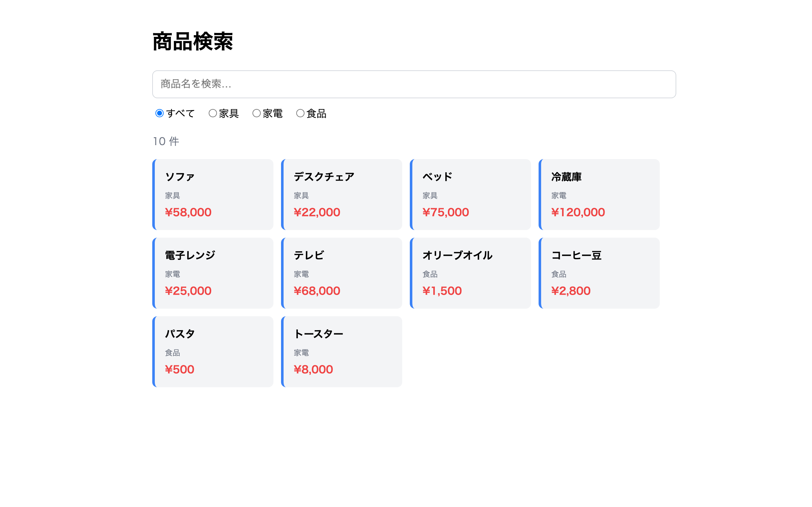

# 上級 問題10: 検索フィルター機能

**難易度: ★★★★★★★★☆☆**

## 🎯 やること

検索ボックスに入力した文字列で、**リアルタイムに商品リストを絞り込む**検索機能を実装します。

## ✅ 要件

1. 商品データ（配列）10 件を用意（名前、カテゴリー、価格）
2. 検索ボックス（`#search`）に文字を入れるたびに**即時フィルター**
3. カテゴリーのラジオボタンで「すべて / 家具 / 家電 / 食品」の切替も可能
4. 結果は動的にカード形式で表示、一致件数も表示
5. マッチは**部分一致、大文字小文字無視**（英字）
6. 該当なしのときは「該当する商品がありません」と表示

## 💡 ヒント

```js
const results = products
  .filter((p) => p.name.toLowerCase().includes(keyword.toLowerCase()))
  .filter((p) => category === 'all' || p.category === category);
```

---

<details>
<summary>🖼 期待される見た目（クリックで展開）</summary>

<!-- 画像を追加するとき: このフォルダに preview.png を保存し、次の行のコメントを外す -->
<!--  -->

> 💡 模範解答をブラウザで開いてスクリーンショットを撮り、`preview.png` としてこのフォルダに保存すると、上の行のコメントを外すだけでプレビュー画像が表示されます。

</details>
