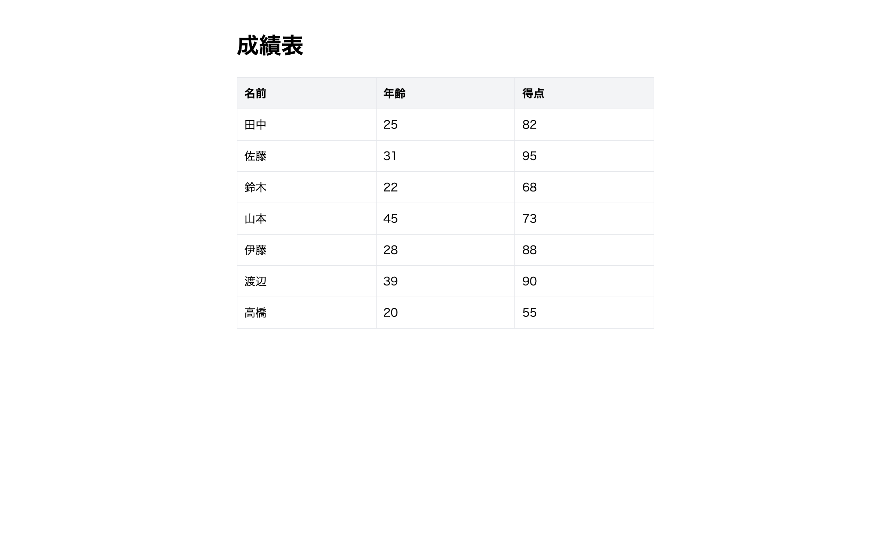

# 上級 問題11: ソート機能付きテーブル

**難易度: ★★★★★★★★☆☆**

## 🎯 やること

**列ヘッダーをクリックすると、その列で昇順／降順にソート**できるテーブルを作ります。

## ✅ 要件

1. 用意された 7 行のデータをテーブルで表示（名前、年齢、得点）
2. 各列ヘッダーをクリック → その列で**昇順**ソート
3. もう一度クリック → **降順**にトグル
4. 現在ソート中の列には ▲（昇順）または ▼（降順）を表示
5. 他の列をクリックしたら、その列の昇順でリセット
6. データは配列で保持、再描画関数でテーブルを作り直す

## 💡 ヒント

```js
data.sort((a, b) => a.age - b.age);       // 数値昇順
data.sort((a, b) => a.name.localeCompare(b.name)); // 文字列
data.reverse(); // 降順
```

---

<details>
<summary>🖼 期待される見た目（クリックで展開）</summary>

<!-- 画像を追加するとき: このフォルダに preview.png を保存し、次の行のコメントを外す -->
<!--  -->

> 💡 模範解答をブラウザで開いてスクリーンショットを撮り、`preview.png` としてこのフォルダに保存すると、上の行のコメントを外すだけでプレビュー画像が表示されます。

</details>
