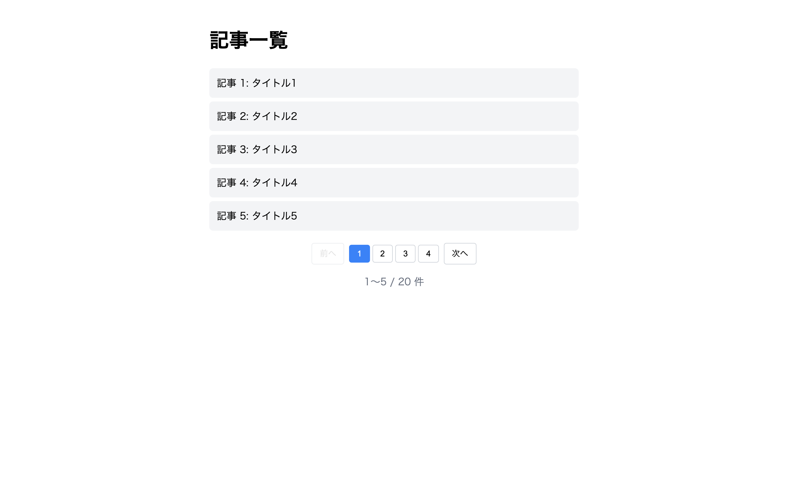

# 上級 問題12: ページネーション

**難易度: ★★★★★★★★☆☆**

## 🎯 やること

20 件のデータを**1 ページ 5 件**ずつ表示する、ページ切替機能を実装します。

## ✅ 要件

1. 用意された 20 件のデータ配列を使う
2. 1 ページあたり 5 件ずつ表示
3. ページ番号ボタン（1 〜 4）と「前へ / 次へ」
4. 現在のページ番号は強調表示（`.active`）
5. 最初のページで「前へ」、最後で「次へ」は `disabled`
6. 現在の表示範囲「X〜Y / 20 件」を表示

## 💡 ヒント

```js
const itemsPerPage = 5;
const total = data.length;
const totalPages = Math.ceil(total / itemsPerPage);

const start = (page - 1) * itemsPerPage;
const end = start + itemsPerPage;
const current = data.slice(start, end);
```

---

<details>
<summary>🖼 期待される見た目（クリックで展開）</summary>

<!-- 画像を追加するとき: このフォルダに preview.png を保存し、次の行のコメントを外す -->
<!--  -->

> 💡 模範解答をブラウザで開いてスクリーンショットを撮り、`preview.png` としてこのフォルダに保存すると、上の行のコメントを外すだけでプレビュー画像が表示されます。

</details>
