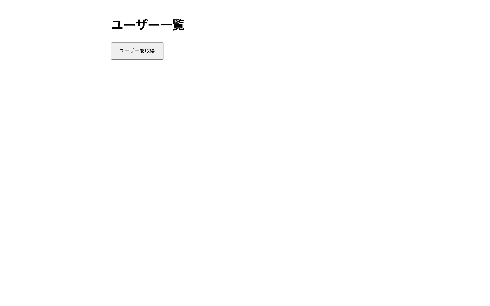

# 上級 問題13: Fetch API で外部データ取得

**難易度: ★★★★★★★★☆☆**

## 🎯 やること

**外部の公開 API** からデータを取得して表示する、非同期処理を学びます。

## ✅ 要件

1. 「ユーザーを取得」ボタンを押すと、以下の API からデータを取得
   - `https://jsonplaceholder.typicode.com/users`
2. 取得中は「読み込み中…」と表示
3. 取得成功したら、名前・メール・電話を並べて表示
4. 取得失敗（ネットワークエラーなど）時は「エラーが発生しました」と赤字で表示
5. **`async/await`** を使って書く

## 💡 ヒント

```js
async function fetchUsers() {
  try {
    const res = await fetch('https://...');
    if (!res.ok) throw new Error('fetch failed');
    const data = await res.json();
    render(data);
  } catch (err) {
    showError();
  }
}
```

---

<details>
<summary>🖼 期待される見た目（クリックで展開）</summary>

<!-- 画像を追加するとき: このフォルダに preview.png を保存し、次の行のコメントを外す -->
<!--  -->

> 💡 模範解答をブラウザで開いてスクリーンショットを撮り、`preview.png` としてこのフォルダに保存すると、上の行のコメントを外すだけでプレビュー画像が表示されます。

</details>
