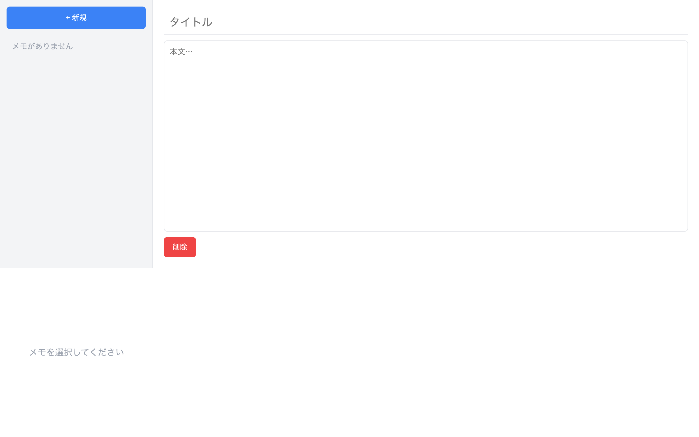

# 上級 問題15: メモアプリ（CRUD）

**難易度: ★★★★★★★★★☆**

## 🎯 やること

**Create / Read / Update / Delete** の 4 操作ができる、本格的なメモアプリを作ります。

## ✅ 要件

1. 左側に**メモ一覧**、右側に**詳細表示 / 編集フォーム**の 2 カラム構成
2. 「新規作成」ボタンで空のメモを作成
3. 一覧からメモを選択 → 右側にタイトルと本文が表示
4. タイトル・本文はその場で編集できる（フォーカス外れたら保存）
5. 「削除」ボタンで選択中のメモを削除（confirm 確認あり）
6. すべて LocalStorage に永続化（キー: `notes`）
7. メモが 0 件のときは「メモがありません」と表示

## 💡 ヒント

```js
const notes = [{ id, title, body, updatedAt }];
let selectedId = null;
```

render 関数で一覧と詳細の両方を更新する。

---

<details>
<summary>🖼 期待される見た目（クリックで展開）</summary>

<!-- 画像を追加するとき: このフォルダに preview.png を保存し、次の行のコメントを外す -->
<!--  -->

> 💡 模範解答をブラウザで開いてスクリーンショットを撮り、`preview.png` としてこのフォルダに保存すると、上の行のコメントを外すだけでプレビュー画像が表示されます。

</details>
