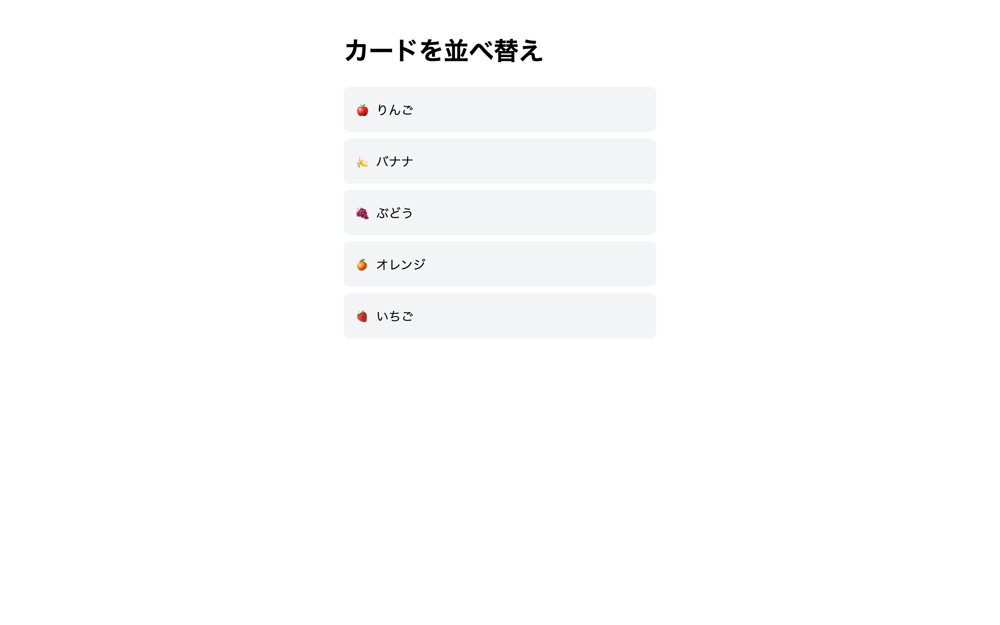

# 上級 問題16: ドラッグ&ドロップ並べ替え

**難易度: ★★★★★★★★★☆**

## 🎯 やること

HTML5 の **Drag and Drop API** を使って、カードの順序を**ドラッグで入れ替え**られるようにします。

## ✅ 要件

1. 縦に並んだ 5 枚のカードがある
2. カードをドラッグすると、その場所以外のカードに**ドロップ可能なプレースホルダー**が表示される
3. 放すと順序が入れ替わる
4. ドラッグ中のカードは半透明
5. **入れ替えた順序**をそのまま表示に反映

## 💡 ヒント

- `draggable="true"` 属性で**ドラッグ可能**に
- `dragstart` / `dragover` / `dragleave` / `drop` / `dragend` イベントを使う
- `e.preventDefault()` を `dragover` で呼ばないとドロップできない

---

🖼 期待される見た目（クリックで展開）

<!-- 画像を追加するとき: このフォルダに preview.png を保存し、次の行のコメントを外す -->
<!--  -->

> 💡 模範解答をブラウザで開いてスクリーンショットを撮り、`preview.png` としてこのフォルダに保存すると、上の行のコメントを外すだけでプレビュー画像が表示されます。

