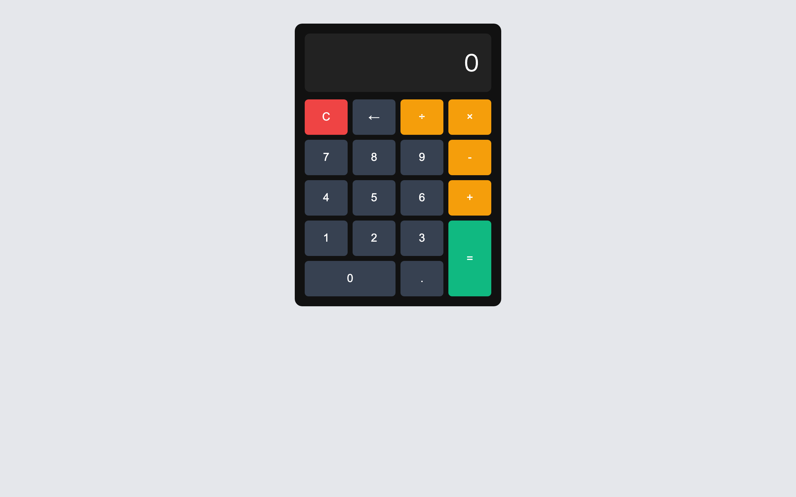

# 上級 問題17: 電卓アプリ

**難易度: ★★★★★★★★★☆**

## 🎯 やること

四則演算ができる**電卓**を作ります。

## ✅ 要件

1. ボタン配置：数字 0〜9、`.`、`+` `-` `×` `÷`、`=`、`C`（クリア）、`←`（バックスペース）
2. ディスプレイに入力した式と結果を表示
3. `=` 押すと計算結果を表示
4. `C` で全クリア、`←` で1文字削除
5. 小数点以下計算にも対応
6. ゼロ除算は `Error` と表示
7. キーボード入力にも対応（数字、演算子、Enter=計算、Esc=クリア、BS=削除）

## 💡 ヒント

`eval()` は危険なので使わない。独自パーサーを書くか、文字列を分割して計算。

```js
// シンプルに eval っぽく動くが安全な書き方
const calc = (expr) => {
  return new Function(`return ${expr}`)();
};
```

**※この問題では学習目的なので `Function` コンストラクタ的な方式で OK。**
ただし、入力を**数字と演算子だけに制限**するサニタイズを行う。

---

<details>
<summary>🖼 期待される見た目（クリックで展開）</summary>



</details>
