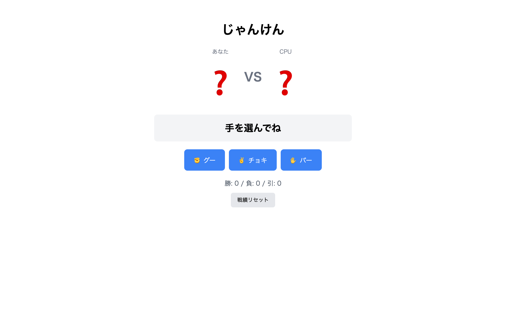

# 上級 問題18: じゃんけんゲーム

**難易度: ★★★★★★★★★☆**

## 🎯 やること

プレイヤー vs コンピュータの**じゃんけん**。勝敗と戦績を表示します。

## ✅ 要件

1. 「グー」「チョキ」「パー」3 つのボタン
2. プレイヤーが選ぶと、コンピュータがランダムに選択
3. 結果（勝ち / 負け / あいこ）を表示
4. 戦績（勝 / 負 / 引）をスコアボードに表示
5. 選んだ手を絵文字で表示（✊ ✌️ ✋）
6. 戦績は LocalStorage に保存し、リロードしても維持される
7. 「リセット」ボタンで戦績を 0 にする

## 💡 ヒント

勝敗判定はいろいろ書き方があるが、シンプルなのは：
```js
const wins = { rock: 'scissors', scissors: 'paper', paper: 'rock' };
if (wins[player] === cpu) playerWins();
```

---

<details>
<summary>🖼 期待される見た目（クリックで展開）</summary>

<!-- 画像を追加するとき: このフォルダに preview.png を保存し、次の行のコメントを外す -->
<!--  -->

> 💡 模範解答をブラウザで開いてスクリーンショットを撮り、`preview.png` としてこのフォルダに保存すると、上の行のコメントを外すだけでプレビュー画像が表示されます。

</details>
