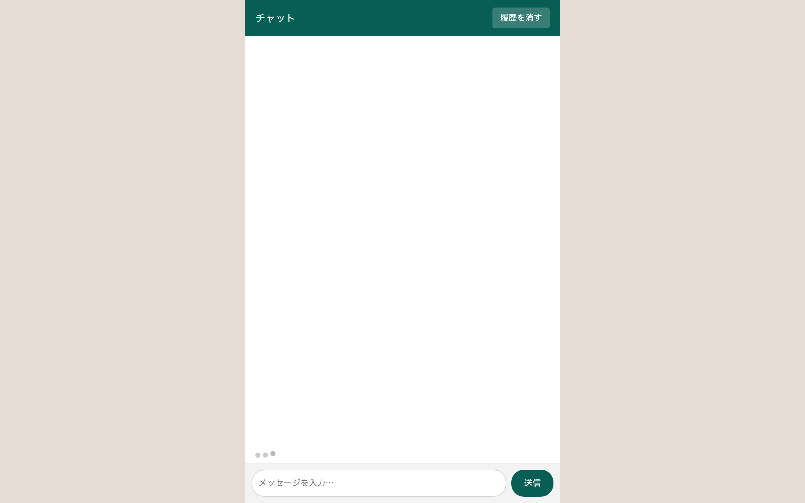

# 上級 問題19: シンプルなチャットUI

**難易度: ★★★★★★★★★★**

## 🎯 やること

LINE や Messenger 風の**チャットUI**を作ります（自分 vs 相手、ローカルで完結）。

## ✅ 要件

1. チャット履歴表示エリア + 下部に入力欄と送信ボタン
2. 入力して送信すると、**右側に自分のメッセージ**（吹き出し、青背景）
3. 自動で **1.5秒後に相手の自動返信**（左側、グレー背景）
   - 返信候補をランダムに 1 つ選ぶ（`["そうなんだ", "なるほど", "それは良いね"]` など 5 個程度）
4. 新しいメッセージが来たら**最下部に自動スクロール**
5. 相手の返信中は「…入力中」という表示が左下に出る（アニメーションするドット）
6. メッセージ送信時刻（`HH:MM`）を吹き出し横に小さく表示
7. 履歴は LocalStorage に保存してリロードしても残る
8. 「履歴を消す」ボタン
9. Enter で送信、Shift+Enter で改行

## 💡 ヒント

```js
const messages = [{ from: 'me' | 'bot', text, time }];
```

---

<details>
<summary>🖼 期待される見た目（クリックで展開）</summary>

<!-- 画像を追加するとき: このフォルダに preview.png を保存し、次の行のコメントを外す -->
<!--  -->

> 💡 模範解答をブラウザで開いてスクリーンショットを撮り、`preview.png` としてこのフォルダに保存すると、上の行のコメントを外すだけでプレビュー画像が表示されます。

</details>
