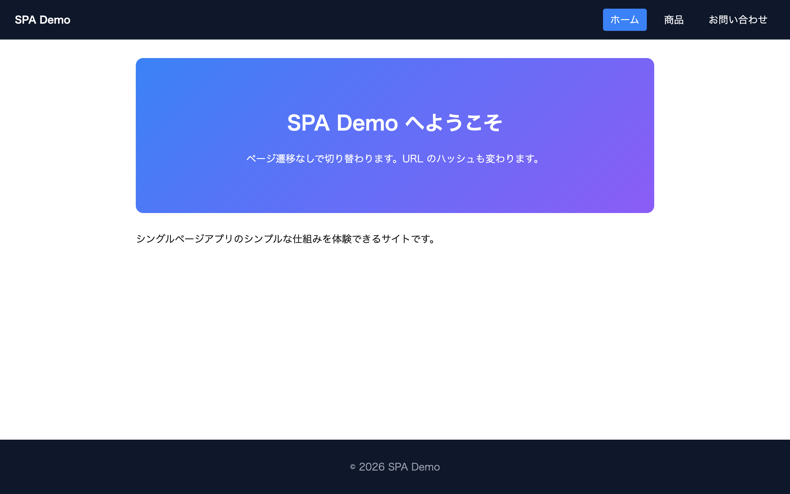

# 上級 問題20: シングルページアプリ風サイト

**難易度: ★★★★★★★★★★**

## 🎯 やること

**ページ遷移をせずに**画面が切り替わる、シングルページアプリ（SPA）風のサイトを作ります。

## ✅ 要件

1. 3 つのページ: **ホーム / 商品一覧 / お問い合わせ**
2. ナビのリンクをクリックすると、ページが**切り替わる**（リロードしない）
3. URL のハッシュ (`#home`, `#products`, `#contact`) と連動
4. ブラウザの**戻る / 進む**ボタンでもページ切り替え可能
5. 現在のページのナビリンクは強調表示
6. 商品一覧ページは配列からカードを動的生成
7. お問い合わせページは簡易フォーム（送信時に alert）

## 💡 ヒント

```js
window.addEventListener('hashchange', () => {
  const hash = location.hash.slice(1) || 'home';
  showPage(hash);
});
```

### ルーティングの仕組み
- `#home` → home ページを表示
- `#products` → products ページを表示
- `#contact` → contact ページを表示

---

<details>
<summary>🖼 期待される見た目（クリックで展開）</summary>

<!-- 画像を追加するとき: このフォルダに preview.png を保存し、次の行のコメントを外す -->
<!--  -->

> 💡 模範解答をブラウザで開いてスクリーンショットを撮り、`preview.png` としてこのフォルダに保存すると、上の行のコメントを外すだけでプレビュー画像が表示されます。

</details>
